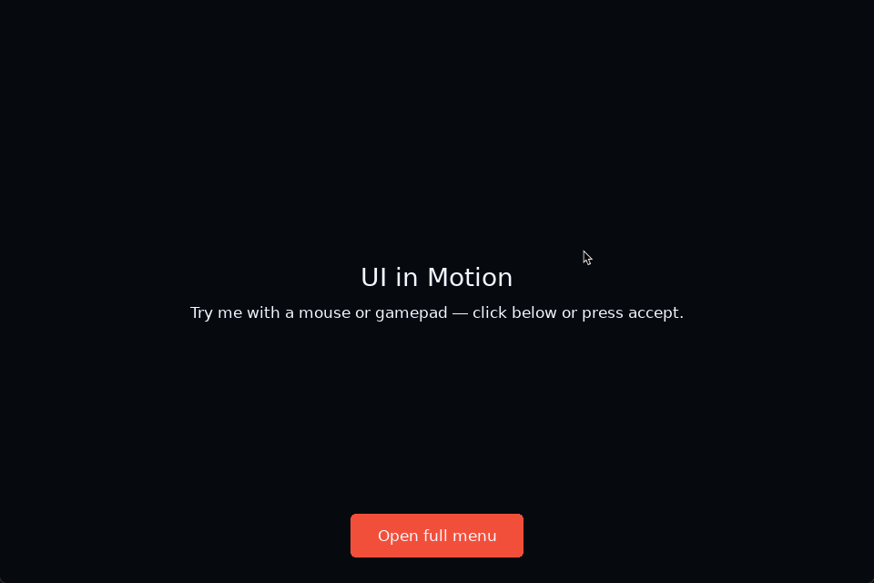
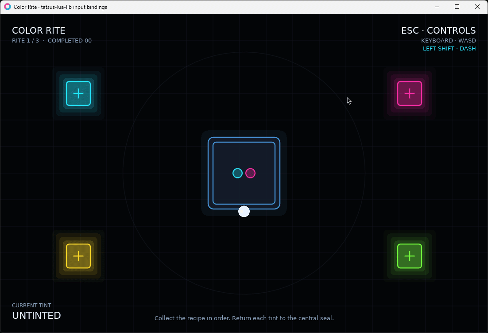

It seems you found my little library for LÖVE2D! Congratz!
You may use anything you found here according to the MIT Licence you find here, but I would appreaciate it, that when you found any module in here useful to add me to the credits or "about" page! I even got a little Text you can copy! :3

Copy me:
Powered by tatsus-lua-lib by TatsuDev! <3

<div align="center">
  <h2>See it in motion</h2>
  <p><strong>UI2D interaction with mouse and gamepad</strong></p>
  
  <br><br>
  <p><strong>Device-aware input bindings demo</strong></p>
  
</div>

## Modules

- `graphics/sprite_font.lua`: Pixel-perfect LÖVE sprite font loader and renderer for Construct-style sprite font metadata.
- `graphics/svg.lua`: General-purpose lightweight SVG parsing, drawing, backdrop, and cache support.
- `animation`: Interruptible, target-driven Motion Values for game and UI animation.
- `ui2d`: Declarative, layered, resolution-independent UI with fit-first media, flex and flow layout, scrollable overflow, spatial input routing, controls, and animated visual transforms.
- `input`: Device-aware semantic Input Actions with independent keyboard/controller Binding Sets, chords, axes, sticks, rebinding, and display prompts.

## Config files

```lua
local Json = require("file.config.json")
local Toml = require("file.config.toml")
local Localization = require("file.config.localization")

local settings = Json.parseFile("save/settings.json")
local config = Toml.parseFile("assets/config/game.toml")

local text = Localization.new({
    locale = "en",
    fallbackLocale = "en",
    path = "assets/lang/{locale}.toml",
    parser = Toml,
})
text:load("de")

print(text:t("MainMenu.play"))
print(text:t("Common.players_finished", { finished = 1, total = 4 }))
```

Language packs are regular config files named by locale, for example `assets/lang/en.toml`, `assets/lang/de.toml`, and `assets/lang/jp.toml`.

The localization loader is parser-agnostic. Pass any parser module with `parse(content)` or `decode(content)`, or pass a parser function directly. The parser should return a nested Lua table:

```lua
local text = Localization.new({
    path = "assets/lang/{locale}.json",
    parser = Json,
})
```

`raw`, `t`, and `has` return an error as their second value when loading or lookup fails:

```lua
local label, err = text:t("MainMenu.play")
if err then
    print(err)
end
```
